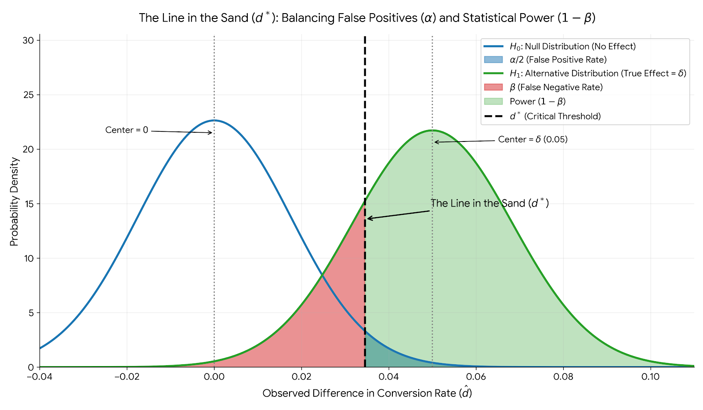

+++
date = '2026-03-12T23:33:33-04:00'
lastmod = '2026-03-16T11:50:00-04:00'
draft = false
title = 'Power-based sample sizing for two common e-commerce KPIs'
categories = ['A/B testing']
+++

When conducting an A/B test in an e-commerce setting, you should always determine your sample size (i.e., the number of sessions to collect, per traffic split) prior to actually launching the A/B test.

If you stop a test too early, you risk seeing a false positive. If you run a test for too long, you waste valuable time and traffic.

To calculate the required sample size, you can use **power-based sample sizing**, a method that balances the acceptable risk of seeing a false positive against the desired probability of detecting a true effect.

This post presents two ways to calculate the required sample size for an A/B test, depending on which of the following two common KPIs you are interested in optimizing: 

- **Conversion Rate (CR):** The proportion of sessions that purchased at least one item
- **Revenue Per Session (RPS):** The average amount of money spent in a session

A **"session"** is a single, continuous period of time a shopper spends actively engaging with a website. Have you browsed a retailer's website recently to find a pair of pants to buy? If so, your entire visit—from clicking the first link, to comparing different styles, to finally closing the tab—constitutes one session.

## Sample Sizing When Optimizing for Conversion Rate

When optimizing for conversion rate, each session results in a binary outcome. A user either converts ($1$) or they do not ($0$).

### Distributional Assumptions and Variable Definitions

* **Bernoulli Trials:** Each session represents an independent Bernoulli trial.
* **Binomial Distribution:** The total number of conversions in a group of size $n$ follows a Binomial distribution.
* **Normal Approximation (Central Limit Theorem):** Because A/B tests typically involve large sample sizes, the Central Limit Theorem (CLT) kicks in and dictates that the *sample proportion* of conversions $\hat{p}$ (or, put more simply, conversion rate) will be approximately normally distributed: $\hat{p} \sim \mathcal{N}\left(p, \frac{p(1-p)}{n}\right)$.
* **Independence:** The control (A) and treatment (B) groups are independent.
* **Equal Sample Sizes:** We assume a 50/50 traffic split ($n_1 = n_2 = n$).

Note the third point above. We are making the implicit assumption that every session that browses through our website has an underlying probability of converting denoted by $p$. This value is unknown to us (otherwise we wouldn't be conducting the A/B test in the first place, because we would know which traffic group has the better true conversion rate).

> **Philosophical note**: It may occur to you that it doesn't really make sense to think of every session as having some fixed but unknown underlying "true" conversion rate. If this was really the case, then $\hat{p}$ would hone in asymptotically on $p$ as we collected more and more sessions (law of large numbers). Once we knew the value of $p$ to a reasonable number of decimal places, we would know the true conversion rate of the traffic group and the game would be done. In reality, the propensity of a person to make a purchase constantly shifts from one moment to the next throughout their shopping session. This means that for a given session, the true underlying conversion probability $p$ is itself a dynamic value, changing from one moment to the next. However, statistics is all about representing some data generating process with some parameterized model, and then using observed data to estimate the parameters of said model. The estimated parameters are often useful to us, providing insight into a process that would otherwise seem unapproachable to scientific analysis. So, we march on with our simplistic assumption of a constant underlying $p$ and the tools of modern statistics ...

Let's define some variables:

* $p_1$: True baseline conversion rate (Control).
* $p_2$: True conversion rate of the variant (Treatment).
* $\delta$: Minimum Detectable Effect (MDE), where $\delta = |p_2 - p_1|$.
* $\alpha$: Significance level (False Positive Rate). We set this value ourselves (usually set to 0.05).
* $1-\beta$: Statistical Power (True Positive Rate). We set this value ourselves (usually set to $1-\beta = 0.80$ or, equivalently, $\beta = 0.20$).
* $Z_{1-\alpha/2}$: The critical Z-score for the significance level (e.g., $1.96$ for $\alpha = 0.05$).
* $Z_{1-\beta}$: The critical Z-score for statistical power (e.g., $0.84$ for $1-\beta = 0.80$).

The actual random variable we are interested in is the difference between the observed sample proportions:

$$\hat{d} = \hat{p}_2 - \hat{p}_1$$

which is the estimator for the difference in the true conversion probability between our treatment and control group:

$$d = p_2 - p_1$$

### The Hypothesis Testing Framework

We evaluate the variance of our random variable $\hat{d}$ under two different assumed realities (hypotheses):

**Reality 1:** Assume NO difference between the control and treatment groups' conversion probabilities

This is the **null hypothesis ($H_0$)**. Under the null hypothesis, we assume there is no actual difference between the variants ($p_2 = p_1$). Anchoring strictly to the baseline (control group) rate, the expected difference is $0$, and the variance of the difference is:

$$Var(\hat{d} \mid H_0) = \frac{p_1(1-p_1)}{n} + \frac{p_1(1-p_1)}{n} = \frac{2p_1(1-p_1)}{n}$$

**Reality 2:** Assume there IS a difference between the control and treatment groups' conversion probabilities

This is the **alternative hypothesis ($H_1$)**. Under the alternative hypothesis, we assume that a real difference exists ($p_2 = p_1 + \delta$). The expected difference is $\delta$, and the variance of the difference is:

$$Var(\hat{d} \mid H_1) = \frac{p_1(1-p_1)}{n} + \frac{p_2(1-p_2)}{n}$$

### Sample Sizing Formula

My goal here is to build up the formula for sample sizing (when optimizing for conversion rate) in a way that feels intuitive.

#### The "Line in the Sand" ($d^*$)

Suppose you run an A/B test and calculate the difference in conversion rates between your treatment and control ($\hat{d} = \hat{p}_2 - \hat{p}_1$).

Before the test begins, you must decide on a **critical threshold**. Let's call this threshold $d^*$.

* If your final observed difference $\hat{d}$ is *greater* than $d^*$, you declare a winner (Statistical Significance).
* If your final observed difference $\hat{d}$ is *less* than $d^*$, you declare the test inconclusive.

Because we are trying to satisfy two different goals simultaneously—limiting False Positives ($\alpha$) and guaranteeing Statistical Power ($1-\beta$)—this single "line in the sand" ($d^*$) must perfectly satisfy two different mathematical constraints.

#### Constraint 1: Limiting False Positives (The Null Perspective)

First, let's assume the treatment group does absolutely nothing (i.e., the null hypothesis, $H_0$, is true).

In this reality, the true difference between control and treatment groups is $0$. Any difference we observe is purely random noise. We want to ensure there is only a 5% probability ($\alpha = 0.05$) that random noise pushes our result past our line in the sand.

To find where that line sits, we start at the center of the null distribution ($0$) and move outward to the right by a specific number of standard errors ($Z_{1-\alpha/2}$).

$$d^* = 0 + Z_{1-\alpha/2} \sqrt{Var(\hat{d} \mid H_0)}$$

Since we know the variance under the null hypothesis is $\frac{2p_1(1-p_1)}{n}$, we can substitute that in. Let's also separate out the $\sqrt{n}$ into the denominator to make the algebra easier later:

**Equation 1:**

$$d^* = \frac{Z_{1-\alpha/2} \sqrt{2p_1(1-p_1)}}{\sqrt{n}}$$

#### Constraint 2: Guaranteeing Power (The Alternative Perspective)

Now, let's flip to reality 2. Here, we assume the treatment group generates a true improvement in the underlying conversion probability (over the control group) equal to your Minimum Detectable Effect ($\delta$).

In this reality, the probability distribution of $\hat{d}$ is centered on $\delta$. We want to ensure there is an 80% probability ($1-\beta = 0.80$) that our observed $\hat{d}$ lands to the *right* of our line in the sand ($d^{*}$). That means there is a 20% probability ($\beta = 0.20$) it lands to the left.

To find where that line sits in reality 2, we start at the center of the alternative distribution ($\delta$) and move *backward* (to the left) by a specific number of standard errors ($Z_{1-\beta}$).

$$d^* = \delta - Z_{1-\beta} \sqrt{Var(\hat{d} \mid H_1)}$$

We know the variance under the alternative hypothesis is $\frac{p_1(1-p_1) + p_2(1-p_2)}{n}$. We substitute that in, again keeping the $\sqrt{n}$ isolated:

**Equation 2:**

$$d^* = \delta - \frac{Z_{1-\beta} \sqrt{p_1(1-p_1) + p_2(1-p_2)}}{\sqrt{n}}$$



#### Deriving the Sample Sizing Formula

Because $d^*$ must be the exact same number in both realities, we can set **Equation 1** and **Equation 2** equal to each other:

$$\frac{Z_{1-\alpha/2} \sqrt{2p_1(1-p_1)}}{\sqrt{n}} = \delta - \frac{Z_{1-\beta} \sqrt{p_1(1-p_1) + p_2(1-p_2)}}{\sqrt{n}}$$

Now, our goal is simply to solve for $n$.

**Step 1: Group all terms with $n$ on the same side.** Add the $Z_{1-\beta}$ fraction to both sides so that $\delta$ is isolated on the right.

$$\frac{Z_{1-\alpha/2} \sqrt{2p_1(1-p_1)}}{\sqrt{n}} + \frac{Z_{1-\beta} \sqrt{p_1(1-p_1) + p_2(1-p_2)}}{\sqrt{n}} = \delta$$

**Step 2: Factor out the common denominator.**
Since both terms on the left share $\sqrt{n}$ as the denominator, we can combine them into a single fraction.

$$\frac{Z_{1-\alpha/2} \sqrt{2p_1(1-p_1)} + Z_{1-\beta} \sqrt{p_1(1-p_1) + p_2(1-p_2)}}{\sqrt{n}} = \delta$$

**Step 3: Swap $\sqrt{n}$ and $\delta$.**
Multiply both sides by $\sqrt{n}$ and divide both sides by $\delta$. This isolates $\sqrt{n}$.

$$\sqrt{n} = \frac{Z_{1-\alpha/2} \sqrt{2p_1(1-p_1)} + Z_{1-\beta} \sqrt{p_1(1-p_1) + p_2(1-p_2)}}{\delta}$$

**Step 4: Square everything to get $n$.**
Finally, we square both sides of the equation to remove the square root from $n$.

$$n = \frac{\left( Z_{1-\alpha/2} \sqrt{2p_1(1-p_1)} + Z_{1-\beta} \sqrt{p_1(1-p_1) + p_2(1-p_2)} \right)^2}{\delta^2}$$

And there we have it. The entire equation is simply the result of mathematically forcing the False Positive cutoff and the True Positive cutoff to exist at the exact same coordinate on a graph, and seeing what sample size ($n$) makes that geometry possible.

## Sample Sizing When Optimizing for Revenue Per Session

Moving from Conversion Rate to Revenue Per Session (RPS) requires shifting from discrete to continuous mathematics. This introduces a major challenge: **variance is no longer directly tied to the (true underlying) mean.**

**Note:** The "true mean" or "expected value" of the revenue random variable (i.e., the random variable that produces observations of per-session revenue) is the same thing as the "true" RPS.

### The Challenge of Revenue Data

Session revenue data violates the assumption of normality. It is characterized by:

* **Zero-Inflation:** A massive probability spike at \$0 (sessions that did not result in a purchase).
* **Right Skew and Heavy Tails:** A long tail driven by high-value outliers ("whales" placing massive orders).

Despite this, we rely heavily on the **Central Limit Theorem (CLT)**. The CLT states that regardless of the underlying distribution, the distribution of the *sample mean* ($\bar{X}$) will eventually approximate a normal distribution, provided the sample size is large enough.

### Sample Sizing Formula

To find the required sample size $n$ when optimizing for RPS, we use the exact same logic used to derive the sample sizing formula when optimizing for conversion rate: we must find a critical threshold for the difference in sample means ($d^*$) that satisfies both our false positive limit ($\alpha$) and our statistical power ($1-\beta$).

Let $\mu_1$ and $\mu_2$ represent the true RPS of the control and treatment, respectively. Let $\sigma^2$ represent the population variance of the revenue (we assume it is the same for both control and treatment groups). We are interested in the difference in sample means: $\hat{d} = \bar{X}_2 - \bar{X}_1$.

**Constraint 1: The Null Perspective ($H_0$)**

Under the null hypothesis (reality 1), we assume the treatment has no effect ($\mu_2 = \mu_1$), so the difference in true RPS between treatment and control groups is $0$.
Because we assume a 50/50 traffic split ($n_1 = n_2 = n$), the variance of the difference in RPS is the sum of the variances of each group's RPS:

$$Var(\hat{d} \mid H_0) = \frac{\sigma^2}{n} + \frac{\sigma^2}{n} = \frac{2\sigma^2}{n}$$

To ensure only a 5% chance of a false positive ($\alpha$), our threshold $d^*$ must sit $Z_{1-\alpha/2}$ standard errors away from $0$:

$$d^* = Z_{1-\alpha/2} \sqrt{\frac{2\sigma^2}{n}}$$

**Constraint 2: The Alternative Perspective ($H_1$)**

Under the alternative hypothesis (reality 2), we assume the treatment group improves upon the control group with a true difference in underlying RPS equal to our Minimum Detectable Effect ($\delta$).

For practical reasons, we assume that the variance of $\hat{d}$ is identical in both realities 1 and 2. Therefore, the variance of $\hat{d}$ remains the same as it was under the null hypothesis:

$$Var(\hat{d} \mid H_1) \approx \frac{2\sigma^2}{n}$$

To ensure an 80% chance of correctly detecting this lift ($1-\beta$), our threshold $d^*$ must sit $Z_{1-\beta}$ standard errors to the left of our true effect $\delta$:

$$d^* = \delta - Z_{1-\beta} \sqrt{\frac{2\sigma^2}{n}}$$

**Solving for $n$**

Because $d^*$ must be the exact same number in both realities, we set the two equations equal to each other:

$$Z_{1-\alpha/2} \sqrt{\frac{2\sigma^2}{n}} = \delta - Z_{1-\beta} \sqrt{\frac{2\sigma^2}{n}}$$

**Step 1:** Group the Z-score terms by adding the $Z_{1-\beta}$ fraction to both sides.

$$Z_{1-\alpha/2} \sqrt{\frac{2\sigma^2}{n}} + Z_{1-\beta} \sqrt{\frac{2\sigma^2}{n}} = \delta$$

**Step 2:** Factor out the common square root term.

$$\sqrt{\frac{2\sigma^2}{n}} (Z_{1-\alpha/2} + Z_{1-\beta}) = \delta$$

**Step 3:** Square both sides of the equation to eliminate the square root.

$$\frac{2\sigma^2}{n} (Z_{1-\alpha/2} + Z_{1-\beta})^2 = \delta^2$$

**Step 4:** Multiply both sides by $n$ and divide by $\delta^2$ to isolate $n$. This gives us the final continuous sample size formula:

$$n = \frac{2\sigma^2 (Z_{1-\alpha/2} + Z_{1-\beta})^2}{\delta^2}$$

## Appendix 

### Python Script for Sample Sizing

Below is a self-contained Python script to calculate sample sizes.

```python
import argparse
import math
import scipy.stats as stats

def calculate_cr_sample_size(p1, mde, alpha=0.05, power=0.80):
    """Calculates sample size for a binomial proportion test."""
    p2 = p1 + mde
    
    # Bounds checking to ensure probabilities remain mathematically valid
    if p2 > 1.0 or p2 < 0.0:
        raise ValueError("The true conversion rate of the variant (baseline + mde) must be between 0.0 and 1.0.")
    
    z_alpha = stats.norm.ppf(1 - alpha / 2)
    z_beta = stats.norm.ppf(power)
    
    sd_null = math.sqrt(2 * p1 * (1 - p1))
    sd_alt = math.sqrt(p1 * (1 - p1) + p2 * (1 - p2))
    
    numerator = (z_alpha * sd_null + z_beta * sd_alt) ** 2
    denominator = mde ** 2
    
    return math.ceil(numerator / denominator)

def calculate_rps_sample_size(variance, mde, alpha=0.05, power=0.80):
    """Calculates sample size for a continuous variable (RPS) test."""
    z_alpha = stats.norm.ppf(1 - alpha / 2)
    z_beta = stats.norm.ppf(power)
    
    numerator = 2 * variance * (z_alpha + z_beta) ** 2
    denominator = mde ** 2
    
    return math.ceil(numerator / denominator)

def estimate_rps_variance(p, aov):
    """Estimates RPS variance using the Law of Total Variance assuming CV=1."""
    return (aov ** 2) * (2 * p - p ** 2)

def main():
    parser = argparse.ArgumentParser(description="A/B Test Sample Size Calculator")
    parser.add_argument("--type", choices=["cr", "rps"], required=True, help="Type of test: 'cr' (Conversion Rate) or 'rps' (Revenue Per Session)")
    parser.add_argument("--baseline", type=float, help="Baseline Conversion Rate (required for 'cr' test, or for 'rps' when estimating variance with --aov)")
    parser.add_argument("--mde", type=float, required=True, help="Absolute Minimum Detectable Effect")
    parser.add_argument("--alpha", type=float, default=0.05, help="Significance level (default: 0.05)")
    parser.add_argument("--power", type=float, default=0.80, help="Statistical power (default: 0.80)")
    
    # Arguments for RPS estimation
    parser.add_argument("--aov", type=float, help="Average Order Value (required if estimating RPS variance)")
    parser.add_argument("--variance", type=float, help="Known RPS variance (overrides --aov estimation)")

    args = parser.parse_args()

    if args.type == "cr":
        if args.baseline is None:
            parser.error("--baseline is required when --type is 'cr'")
            
        try:
            n = calculate_cr_sample_size(args.baseline, args.mde, args.alpha, args.power)
            print(f"\n[Conversion Rate Test]")
            print(f"Required Sample Size: {n:,} per variation\n")
        except ValueError as e:
            print(f"\nError: {e}\n")

    elif args.type == "rps":
        if args.variance:
            var = args.variance
            print(f"\n[RPS Test - Using Provided Variance: {var:.4f}]")
        elif args.baseline is not None and args.aov is not None:
            var = estimate_rps_variance(args.baseline, args.aov)
            print(f"\n[RPS Test - Using Estimated Variance (CV=1): {var:.4f}]")
        else:
            print("\nError: For an RPS test, you must provide either --variance OR both --baseline (as Conversion Rate) and --aov.\n")
            return

        n = calculate_rps_sample_size(var, args.mde, args.alpha, args.power)
        print(f"Required Sample Size: {n:,} per variation\n")

if __name__ == "__main__":
    main()

```

### Power Visualization Script (Conversion Rate)

```python
import numpy as np
import matplotlib.pyplot as plt
import scipy.stats as stats

# A/B Test Parameters
p1 = 0.20
p2 = 0.25
n = 1030
delta = p2 - p1

# Standard Errors
se0 = np.sqrt(2 * p1 * (1 - p1) / n)
se1 = np.sqrt(p1 * (1 - p1) / n + p2 * (1 - p2) / n)

# Significance level and threshold
alpha = 0.05
z_alpha = stats.norm.ppf(1 - alpha / 2)
d_star = z_alpha * se0

# X-axis range for plotting
x = np.linspace(-0.04, 0.12, 1000)

# Y-axis values for both distributions
y0 = stats.norm.pdf(x, 0, se0)
y1 = stats.norm.pdf(x, delta, se1)

# Create the plot
fig, ax = plt.subplots(figsize=(12, 7))

# Plot H0 Distribution
ax.plot(x, y0, label=r'$H_0$: Null Distribution (No Effect)', color='#1f77b4', lw=2.5)
ax.fill_between(x, y0, where=(x >= d_star), color='#1f77b4', alpha=0.5, label=r'$\alpha / 2$ (False Positive Rate)')

# Plot H1 Distribution
ax.plot(x, y1, label=r'$H_1$: Alternative Distribution (True Effect = $\delta$)', color='#2ca02c', lw=2.5)
ax.fill_between(x, y1, where=(x <= d_star), color='#d62728', alpha=0.5, label=r'$\beta$ (False Negative Rate)')
ax.fill_between(x, y1, where=(x > d_star), color='#2ca02c', alpha=0.3, label=r'Power ($1-\beta$)')

# The "Line in the Sand"
ax.axvline(d_star, color='black', linestyle='--', lw=2.5, label=r'$d^*$ (Critical Threshold)')

# Center lines for reference
ax.axvline(0, color='gray', linestyle=':', lw=1.5)
ax.axvline(delta, color='gray', linestyle=':', lw=1.5)

# Increase the maximum y-limit so the legend has room to breathe above the curves
ax.set_ylim(0, max(max(y0), max(y1)) * 1.35)

# Annotations
ax.annotate(r'Center = $0$', xy=(0, max(y0)*0.95), xytext=(-0.025, max(y0)*0.95),
            arrowprops=dict(facecolor='black', arrowstyle='->'), fontsize=11)

ax.annotate(r'Center = $\delta$ (0.05)', xy=(delta, max(y1)*0.95), xytext=(delta + 0.015, max(y1)*0.95),
            arrowprops=dict(facecolor='black', arrowstyle='->'), fontsize=11)

ax.annotate(r'The Line in the Sand ($d^*$)', xy=(d_star, max(y0)*0.6), xytext=(d_star + 0.015, max(y0)*0.65),
            arrowprops=dict(facecolor='black', arrowstyle='->', lw=1.5), fontsize=13, fontweight='bold')

# Formatting
ax.set_title(r'The Line in the Sand ($d^*$): Balancing False Positives ($\alpha$) and Statistical Power ($1-\beta$)', fontsize=15, pad=15)
ax.set_xlabel(r'Observed Difference in Conversion Rate ($\hat{d}$)', fontsize=13)
ax.set_ylabel(r'Probability Density', fontsize=13)

# Place legend in upper right but now with plenty of space above the curves
ax.legend(loc='upper right', fontsize=11)

ax.grid(True, alpha=0.2)
ax.set_xlim(-0.04, 0.11)

# Removing top and right spines
ax.spines['top'].set_visible(False)
ax.spines['right'].set_visible(False)

plt.tight_layout()
plt.savefig('line_in_the_sand_fixed.png', dpi=300)
```

## References

* Miller, E. (n.d.). *Sample Size Calculator*. Evan's Awesome A/B Tools. Retrieved from [https://www.evanmiller.org/ab-testing/sample-size.html](https://www.evanmiller.org/ab-testing/sample-size.html)
* Kohavi, R., Tang, D., & Xu, Y. (2020). *Trustworthy Online Controlled Experiments: A Practical Guide to A/B Testing*. Cambridge University Press.
* Casella, G., & Berger, R. L. (2002). *Statistical Inference* (2nd ed.). Duxbury.
