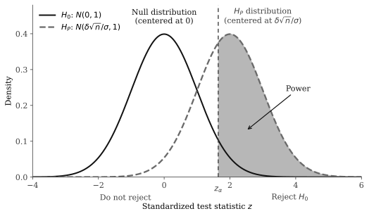
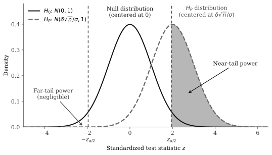
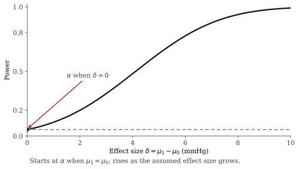
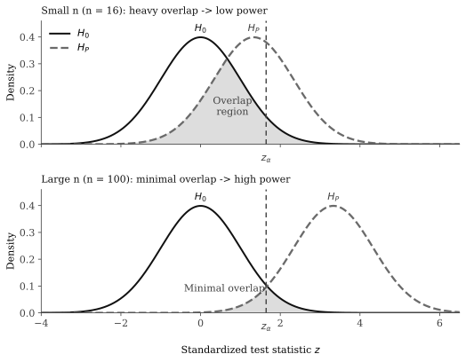
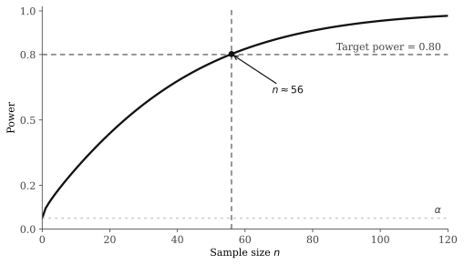

+++
date = '2026-03-20T14:16:27-04:00'
draft = false
title = 'How I think about statistical power'
categories = ['statistics']
+++

Suppose you are designing a clinical trial to test whether a new drug lowers systolic blood pressure. Your null hypothesis is that the drug has no effect: $H_0$: $\mu = 0$, where $\mu$ is the true mean reduction in blood pressure. You plan to collect data, compute a test statistic, and reject the null if the evidence is strong enough.

Before running the trial, someone asks: *what is the probability that your study will detect the drug's effect?*

In statistics speak, the person is asking: What is the probability that your hypothesis test will result in a correct rejection of the null?

> **Note** that the person's question is implicitly assuming that the drug works. This is the key assumption that makes "probability of correctly rejecting the null" a meaningful concept. The word "correct" implies that we are assuming that the drug does indeed work (which in reality we cannot know).

The person is asking about the hypothesis test's **statistical power**. And it sounds like it should have a straightforward answer. But try to answer it and you immediately run into a problem: detect *what size* effect? The probability of detecting a 1 mmHg reduction is very different from the probability of detecting a 20 mmHg reduction. Both assume "the drug works," but they imply completely different probabilities of rejecting the null.

To answer the power question, you need to assume not just that the drug works, but *how much* it works. And that choice is not part of the hypothesis test itself. It is an additional assumption that you, the analyst, must make.

This post introduces a framework that makes this distinction explicit. Instead of the usual two hypotheses, we work with three. The first two define the hypothesis test. The third — which I call the *power hypothesis* — is what you need to calculate power. The standard textbook framework conflates the second and third under a single label, which is where much of the confusion around power comes from.

## The standard framework and where it breaks

### The hypothesis test

A hypothesis test begins with two hypotheses:

- **Null hypothesis** $H_0$: a claim about the parameter of interest. For example, $H_0$: $\mu = 0$ (two-tailed) or $H_0$: $\mu \leq 0$ (one-sided).
- **Alternative hypothesis** $H_1$: the complement of the null. For example, $H_1$: $\mu \neq 0$ (two-tailed) or $H_1$: $\mu > 0$ (one-sided).

You choose a significance level $\alpha$ (commonly 0.05), compute a test statistic from your data, and reject $H_0$ if the test statistic falls in the rejection region — a region determined entirely by $H_0$ and $\alpha$. If you reject, you say you have found evidence against $H_0$ in favor of $H_1$.

This part of the framework is clean and internally consistent. Notably, the alternative hypothesis $H_1$ does not need to be a specific value — it just needs to be the complement of the null. If $H_0$ says $\mu = 0$, then $H_1$ says $\mu \neq 0$, and that is sufficient for the test.

### Where it breaks

Now suppose you want to compute power — the probability of correctly rejecting $H_0$ when the null is false, i.e., when "the alternative is true." Here is where the framework runs into trouble.

$H_1$: $\mu \neq 0$ is a *composite* hypothesis. It is the set $\{\mu : \mu \neq 0\}$, which contains infinitely many values. The probability of rejection depends on *which* value in this set is the true one. Power against $\mu = 0.5$ is not the same as power against $\mu = 10$. You cannot compute a single number for $P(\text{reject } H_0 \mid H_1 \text{ is true})$ because that probability is different for every value of $\mu$ consistent with $H_1$.

To get an actual number, textbooks then write something like: "Suppose the true mean is $\mu = \delta$." But this is no longer $H_1$: $\mu \neq 0$. It is a much more specific claim — a single point inside the composite set. The textbook has quietly switched from the complement-of-null to a particular point value, while continuing to call both "$H_1$."

This conflation is the source of a great deal of confusion about what power is, what it depends on, and why it is more subjective than the hypothesis test itself.

## Three hypotheses

To untangle the conflation, I want to introduce a framework with three distinct hypotheses, each with a clear name, notation, and role.

| Hypothesis | Notation | Type | Role |
|---|---|---|---|
| **Null hypothesis** ($H_0$) | $\mu = \mu_0$ (or $\mu \leq \mu_0$) | Point or composite | Defines the test; anchors the rejection rule |
| **Alternative hypothesis** ($H_1$) | $\mu \neq \mu_0$ (or $\mu > \mu_0$) | Composite | Complement of $H_0$; what you reject "in favor of" |
| **Power hypothesis** ($H_P$) | $\mu = \mu_1$, where $\mu_1 \neq \mu_0$ | Point | The specific scenario under which you compute power |

The critical distinctions:

- **$H_0$ and $H_1$ are part of the hypothesis test.** Together they partition the parameter space. They define what it means to reject or fail to reject. They determine the rejection region.

- **$H_P$ is not part of the hypothesis test.** The test does not know about $H_P$. The test never uses $\mu_1$. You could run the exact same test without ever specifying $H_P$.

- **$H_P$ is a point inside $H_1$**, but it is not $H_1$. This is the key distinction. $H_1$ is a vast set of values. $H_P$ is a single point chosen from that set. Knowing the weather on a continent requires knowing which city you are in. Similarly, computing power under $H_1$ requires specifying which point $\mu_1$ inside $H_1$ you are assuming.

We define the quantity

$$\delta = \mu_1 - \mu_0$$

as the assumed effect size — the gap between the null value and the power hypothesis value. This $\delta$ is a **choice made by the analyst**. Different analysts can (and do) choose different values of $\delta$, and they will arrive at different power numbers from the same test.

## Three realities

The three hypotheses give rise to three possible states of the world — three "realities."

**Reality 1: $H_0$ is true** ($\mu = \mu_0$)

The sampling distribution of the test statistic is fully specified. It is centered at zero (under the standard normalization). We can compute $P(\text{reject } H_0) = \alpha$. A rejection in this reality is a Type I error (false positive). A failure to reject is a correct decision (true negative).

**Reality 2: $H_1$ is true, but $H_P$ is unspecified** ($\mu \neq \mu_0$, but we do not know $\mu$)

We know that $H_0$ is false, so rejecting $H_0$ would be the correct decision. But we cannot compute the probability of rejection, because we do not know where in $H_1$ the true value lives. The probability of rejection as a function of $\mu$ varies across all of $H_1$. **We are stuck.**

**Reality 3: $H_P$ is true** ($\mu = \mu_1$)

The sampling distribution of the test statistic is fully specified. It is centered at $\frac{\delta}{\sigma/\sqrt{n}}$. *Now* we can compute $P(\text{reject } H_0) = 1 - \beta$. **This is power.** A rejection in this reality is a correct decision (true positive). A failure to reject is a Type II error (false negative).

$$\text{Reality 1 } (H_0 \text{ true}) \longrightarrow P(\text{reject}) = \alpha \longleftarrow \text{computable}$$

$$\text{Reality 2 } (H_1 \text{ true}) \longrightarrow P(\text{reject}) = \text{???} \longleftarrow \text{NOT computable}$$

$$\text{Reality 3 } (H_p \text{ true}) \longrightarrow P(\text{reject}) = 1 - \beta = \text{power} \longleftarrow \text{computable}$$

**Power lives in Reality 3, not Reality 2.** You cannot talk about power without specifying $H_P$. The composite alternative $H_1$ tells you the *direction* of the effect (or simply that it is non-zero), but not its *magnitude*. Magnitude is what you need.

In each computable reality, there are two possible outcomes depending on whether the test statistic falls in the rejection region:

```
                   ┌─────────────────────┐
               Reality 1              Reality 3
              (H₀ true)              (Hₚ true)
               ┌───┴───┐              ┌───┴───┐
            Reject  Fail to         Reject  Fail to
             H₀    reject H₀        H₀    reject H₀
              │       │               │       │
          Type I    Correct        Correct   Type II
           Error   Decision       Decision    Error
            (α)    (1 − α)        (1 − β)     (β)
                                     ↑
                                   POWER
```

Notice that Reality 2 is absent from this tree. It is absent because we cannot attach probabilities to its branches without further specifying which value of $\mu$ inside $H_1$ is the true one — which is exactly what $H_P$ does.

## Computing power: the one-sided case

Let us now work through the mechanics, starting with the simpler one-sided case.

**Setup:**

- $H_0$: $\mu \leq \mu_0$ (null hypothesis)
- $H_1$: $\mu > \mu_0$ (alternative hypothesis, complement of $H_0$)
- $H_P$: $\mu = \mu_1$, where $\mu_1 > \mu_0$ (power hypothesis)

We assume we know the population standard deviation $\sigma$ and that $\bar{X}$ is approximately normal (either because the population is normal or $n$ is large enough for the Central Limit Theorem).

**Test statistic:**

$$Z = \frac{\bar{X} - \mu_0}{\sigma / \sqrt{n}}$$

**Rejection rule:** Reject $H_0$ when $Z > z_\alpha$, where $z_\alpha$ is the upper $\alpha$-quantile of the standard normal distribution (e.g., $z_{0.05} = 1.645$).

**Under Reality 1** ($\mu = \mu_0$): $Z \sim N(0, 1)$. The rejection probability is $P(Z > z_\alpha) = \alpha$, by construction.

**Under Reality 3** ($\mu = \mu_1$):

$$Z = \frac{\bar{X} - \mu_0}{\sigma / \sqrt{n}} \sim N\!\left(\frac{\mu_1 - \mu_0}{\sigma / \sqrt{n}},\; 1\right) = N\!\left(\frac{\delta\sqrt{n}}{\sigma},\; 1\right)$$

The test statistic is no longer centered at zero — it is centered at $\frac{\delta\sqrt{n}}{\sigma}$, which we call the *noncentrality parameter*. Power is the probability that a draw from this shifted distribution exceeds $z_\alpha$:

$$\text{Power} = P(Z > z_\alpha \mid H_P) = 1 - \Phi\!\left(z_\alpha - \frac{\delta\sqrt{n}}{\sigma}\right)$$

where $\Phi$ is the standard normal cumulative distribution function (CDF).

**The geometric picture:**



The key insight is geometric: $\frac{\delta\sqrt{n}}{\sigma}$ controls how far the $H_P$ distribution sits to the right of the null distribution. The further right, the less overlap between the two distributions, and the more of the $H_P$ distribution's area falls beyond $z_\alpha$.

**Worked example:**

Let $\mu_0 = 0$ (no effect), $\mu_1 = 5$ mmHg (the power hypothesis says the drug reduces blood pressure by 5 mmHg), $\sigma = 15$, $n = 36$, and $\alpha = 0.05$.

- Critical value: $z_\alpha = z_{0.05} = 1.645$
- Noncentrality parameter: $\frac{\delta\sqrt{n}}{\sigma} = \frac{5 \times 6}{15} = 2.0$
- Power: $1 - \Phi(1.645 - 2.0) = 1 - \Phi(-0.355) \approx 1 - 0.361 = 0.639$

Under the power hypothesis $H_P$: $\mu = 5$, there is a 63.9% chance that the test correctly rejects the null. Note that this says nothing about whether the true mean actually is 5. It says: *if* it were, this is the detection probability.

**A note on composite alternatives and lower bounds.** In the one-sided setup, the alternative $H_1$: $\mu > \mu_0$ is composite. If the true mean $\mu^*$ exceeds $\mu_1$ (i.e., $\mu^* > \mu_1$), then the $H_P$ distribution would be shifted even further right, and power would be even higher. Therefore, the power computed at $\mu_1$ is a **lower bound** on the power for all $\mu^* \geq \mu_1$. This is a useful property: by choosing a $\mu_1$ that you consider the smallest effect worth detecting, you obtain a minimum power level.

## Computing power: the two-tailed case

Now consider the two-tailed setting.

**Setup:**

- $H_0$: $\mu = \mu_0$ (null hypothesis)
- $H_1$: $\mu \neq \mu_0$ (alternative hypothesis, complement of $H_0$)
- $H_P$: $\mu = \mu_1$, where $\mu_1 \neq \mu_0$ (power hypothesis; say $\mu_1 > \mu_0$)

**Rejection rule:** Reject $H_0$ when $|Z| > z_{\alpha/2}$. That is, reject when the test statistic falls in either tail:

$$Z > z_{\alpha/2} \quad \text{or} \quad Z < -z_{\alpha/2}$$

**Under Reality 3** ($\mu = \mu_1 > \mu_0$), the test statistic $Z$ has the same shifted distribution as before: $Z \sim N(\delta\sqrt{n}/\sigma,\; 1)$. But now there are two rejection regions, so power is the sum of two probabilities:

$$\text{Power} = P(Z > z_{\alpha/2} \mid H_P) + P(Z < -z_{\alpha/2} \mid H_P)$$

Expanding:

$$\text{Power} = \left[1 - \Phi\!\left(z_{\alpha/2} - \frac{\delta\sqrt{n}}{\sigma}\right)\right] + \Phi\!\left(-z_{\alpha/2} - \frac{\delta\sqrt{n}}{\sigma}\right)$$

The first term is the **near tail** — the rejection region in the direction of $\mu_1$. It captures most of the power. The second term is the **far tail** — the rejection region on the opposite side. It is almost always negligible, because the $H_P$ distribution is shifted *away* from that tail.



**Worked example (same parameters):**

$\mu_0 = 0$, $\mu_1 = 5$, $\sigma = 15$, $n = 36$, $\alpha = 0.05$.

- Critical value: $z_{\alpha/2} = z_{0.025} = 1.96$
- Noncentrality parameter: $\frac{\delta\sqrt{n}}{\sigma} = 2.0$ (same as before)
- Near-tail power: $1 - \Phi(1.96 - 2.0) = 1 - \Phi(-0.04) \approx 0.516$
- Far-tail power: $\Phi(-1.96 - 2.0) = \Phi(-3.96) \approx 0.00004$
- Total power: $0.516 + 0.00004 \approx 0.516$

Compare this to the one-sided power of 0.639 from the previous section. Same $\alpha$, same $\delta$, same $n$ — but the two-tailed test has substantially less power.

**Why?** The two-tailed test "spends" its $\alpha$ budget on two tails: $\alpha/2 = 0.025$ in each. This pushes the critical values outward ($z_{0.025} = 1.96$ versus $z_{0.05} = 1.645$ for the one-sided case), making it harder to reject $H_0$. The far tail buys almost no additional power — the $H_P$ distribution barely reaches it — so the net effect is simply a higher bar for rejection.

This is the cost of not committing to a direction in $H_1$. If you know beforehand that the effect can only go in one direction (or you only care about one direction), a one-sided test is more powerful for the same $\alpha$.

## Power is subjective

We have now seen the mechanics: power is computed under Reality 3, using $H_P$: $\mu = \mu_1$. The choice of $\mu_1$ — and therefore $\delta = \mu_1 - \mu_0$ — determines the answer.

This makes power inherently subjective.

Consider two researchers, both planning the same blood pressure trial, both using $\alpha = 0.05$, both with $\sigma = 15$ and $n = 36$. Researcher A believes the drug lowers blood pressure by 5 mmHg and sets $H_P$: $\mu = 5$. Researcher B believes the effect is 10 mmHg and sets $H_P$: $\mu = 10$. Using the one-sided test:

- Researcher A's power: $1 - \Phi(1.645 - 2.0) = 0.639$
- Researcher B's power: $1 - \Phi(1.645 - 4.0) = 1 - \Phi(-2.355) \approx 0.991$

Same test, same data, same $\alpha$ — but power of 0.639 versus 0.991 because of a different choice of $H_P$.

Neither researcher is wrong. They are simply answering different questions: "What is the detection probability *if* the effect is 5 mmHg?" versus "What is the detection probability *if* the effect is 10 mmHg?" Power is always conditional on a specific $H_P$, whether this is stated explicitly or not.

### The power function

Rather than commit to a single $H_P$, we can view power as a *function* of $\mu_1$ (or equivalently, of $\delta$). This is the **power function**:

$$\text{Power}(\mu_1) = P(\text{reject } H_0 \mid \mu = \mu_1)$$

plotted for every possible $\mu_1$.



Key features of this curve:

- **At $\mu_1 = \mu_0$** (i.e., $\delta = 0$), we are back in Reality 1. "Power" at this point is just $\alpha$ — the probability of a Type I error. It is not really power at all; it is the significance level.

- **As $|\delta|$ increases**, the $H_P$ distribution shifts further from the null, and power rises toward 1.

- **The curve is S-shaped**, resembling a cumulative normal CDF.

A single power number — like "this study has 80% power" — is a single point on this curve. It corresponds to a specific $\mu_1$. The choice of which point to read off is the subjective element. When someone reports "80% power," they mean "80% power *at a particular $\mu_1$ that I chose*." The conditional on $H_P$ is always there, whether stated or hidden.

## Sample size: the lever you control

In practice, the most common use of power analysis is to determine the sample size needed to achieve a target power level. The logic runs as follows: you fix $\alpha$ (the significance level), you choose $H_P$ (the effect size you want to detect), you set a target power (commonly 80%), and you solve for $n$.

### How $n$ affects power mechanically

Recall the noncentrality parameter: $\frac{\delta\sqrt{n}}{\sigma}$. This quantity measures how far the $H_P$ distribution sits from the null distribution, in units of the test statistic. As $n$ grows:

1. The standard error $\sigma / \sqrt{n}$ shrinks.
2. Both the null and $H_P$ distributions become narrower (in the original $\bar{X}$ scale).
3. In the standardized test-statistic scale, the $H_P$ distribution's center $\frac{\delta\sqrt{n}}{\sigma}$ moves further from zero.
4. The overlap between the two distributions decreases.
5. Power increases.



The mechanism is simple: more data means less noise, which means a clearer signal, which means a higher probability of detecting that signal.

### Sample size formulas

We can solve the power equation for $n$. Setting the target power at $1 - \beta$ and solving:

**One-sided test:**

$$n = \left(\frac{(z_\alpha + z_\beta) \cdot \sigma}{\delta}\right)^2$$

**Two-tailed test:**

$$n = \left(\frac{(z_{\alpha/2} + z_\beta) \cdot \sigma}{\delta}\right)^2$$

where $z_\beta$ is the upper $\beta$-quantile of the standard normal (e.g., for 80% power, $\beta = 0.20$ and $z_\beta = 0.842$).

**Worked example (one-sided):**

To detect $\delta = 5$ mmHg with $\sigma = 15$, $\alpha = 0.05$, and a target power of 80%:

$$n = \left(\frac{(1.645 + 0.842) \times 15}{5}\right)^2 = \left(\frac{2.487 \times 15}{5}\right)^2 = \left(\frac{37.305}{5}\right)^2 = (7.461)^2 \approx 56$$

You need approximately 56 observations.

### The subjectivity propagates

Notice that $\delta$ appears in the denominator of the sample size formula. This means:

- **Sample size determination requires $H_P$.** There is no way to determine the required sample size without choosing a specific effect size $\delta$.
- **Smaller $\delta$ (smaller assumed effects) demands larger $n$.** If you want to detect a 2 mmHg effect instead of a 5 mmHg effect (with everything else held constant), you need $n = (2.487 \times 15 / 2)^2 \approx 348$ observations — more than six times as many.
- **The subjectivity of $H_P$ flows directly into the "required" sample size.** Two analysts who choose different $\delta$ values will arrive at different sample size requirements, even for the identical study design.

The relationship between power and sample size for a fixed $\delta$ looks like this:



Power increases monotonically with $n$, but with diminishing returns. The first additional observations buy the most power; later ones contribute less and less. This is because power is a function of $\sqrt{n}$, not $n$ — doubling the sample size does not double the noncentrality parameter.

## Final remarks

The three-hypothesis framework can be distilled into three activities:

1. **Design your test** using $H_0$ and $H_1$. Choose $\alpha$. This gives you the rejection rule. No $\delta$ is needed.

2. **Evaluate your test** using $H_P$. Choose $\mu_1$ (and therefore $\delta$). This gives you power. The power number is conditional on your choice.

3. **Size your study** by choosing a target power and solving for $n$. This requires $H_P$ — there is no way around it.

Activities 2 and 3 are typically done during the planning phase of a study, before any data is collected.

The three realities, summarized:

| Reality | $P(\text{reject } H_0)$ | Interpretation |
| :--- | :--- | :--- |
| $H_0$ true ($\mu = \mu_0$) | $\alpha$ | Significance level |
| $H_1$ true ($\mu \neq \mu_0$) | Unknown | Depends on which $\mu$ is true |
| $H_p$ true ($\mu = \mu_1$) | $1 - \beta$ | Power |

A few clarifications that follow directly from this framework:

- **"The study has 80% power"** always means "the study has 80% power *assuming $H_P$ is true for a particular $\mu_1$*." The conditional on $H_P$ is always there, whether stated or not.

- **"The probability of a Type II error is $\beta$"** always means "$\beta$ *at a specific $\mu_1$*." There is no single, unconditional $\beta$ for a test.

- **The reason different sources give different power numbers** for what looks like the same test is almost always that they are assuming different $H_P$ values — different $\delta$'s.

## Appendix

The following is the exact Python script used to generate the five figures in this post.

```python
from __future__ import annotations

import math
from pathlib import Path
from statistics import NormalDist

import matplotlib

matplotlib.use("Agg")
import matplotlib.pyplot as plt

OUTPUT_DIR = Path(__file__).parent
STANDARD_NORMAL = NormalDist()

BLACK = "#111111"
DARK = "#404040"
MID = "#6A6A6A"
LIGHT = "#C7C7C7"
FILL = "#DCDCDC"
POWER_FILL = "#AFAFAF"
RED = "#B00000"

plt.rcParams.update(
    {
        "svg.fonttype": "none",
        "figure.facecolor": "white",
        "axes.facecolor": "white",
        "font.family": "DejaVu Serif",
        "font.size": 11,
        "axes.spines.top": False,
        "axes.spines.right": False,
    }
)


def linspace(start: float, stop: float, count: int) -> list[float]:
    if count < 2:
        return [start]
    step = (stop - start) / (count - 1)
    return [start + step * index for index in range(count)]


def normal_pdf(xs: list[float], mean: float = 0.0, sd: float = 1.0) -> list[float]:
    coefficient = 1.0 / (sd * math.sqrt(2.0 * math.pi))
    return [coefficient * math.exp(-0.5 * ((x - mean) / sd) ** 2) for x in xs]


def one_sided_power(delta: float, sigma: float, n: float, alpha: float) -> float:
    z_alpha = STANDARD_NORMAL.inv_cdf(1.0 - alpha)
    noncentrality = delta * math.sqrt(n) / sigma
    return 1.0 - STANDARD_NORMAL.cdf(z_alpha - noncentrality)


def two_tailed_power(delta: float, sigma: float, n: float, alpha: float) -> float:
    z_half = STANDARD_NORMAL.inv_cdf(1.0 - alpha / 2.0)
    noncentrality = delta * math.sqrt(n) / sigma
    near_tail = 1.0 - STANDARD_NORMAL.cdf(z_half - noncentrality)
    far_tail = STANDARD_NORMAL.cdf(-z_half - noncentrality)
    return near_tail + far_tail


def style_axes(ax) -> None:
    ax.tick_params(colors=DARK)
    ax.spines["left"].set_color(DARK)
    ax.spines["bottom"].set_color(DARK)


def save_figure(fig: plt.Figure, filename: str) -> None:
    fig.tight_layout()
    fig.savefig(OUTPUT_DIR / filename, bbox_inches="tight")
    plt.close(fig)


def plot_one_sided_geometry() -> None:
    z_alpha = STANDARD_NORMAL.inv_cdf(0.95)
    shift = 2.0
    xs = linspace(-4.0, 6.0, 900)
    null_y = normal_pdf(xs, mean=0.0)
    hp_y = normal_pdf(xs, mean=shift)

    fig, ax = plt.subplots(figsize=(7.4, 4.4))
    ax.plot(xs, null_y, color=BLACK, linewidth=2.0, label=r"$H_0$: $N(0, 1)$")
    ax.plot(
        xs,
        hp_y,
        color=MID,
        linewidth=2.3,
        linestyle="--",
        label=r"$H_P$: $N(\delta\sqrt{n}/\sigma, 1)$",
    )
    ax.fill_between(xs, hp_y, where=[x >= z_alpha for x in xs], color=POWER_FILL, alpha=0.9)
    ax.axvline(z_alpha, color=DARK, linewidth=1.4, linestyle=(0, (4, 3)))

    ax.text(0.0, max(null_y) + 0.03, 
        r"Null distribution"
        "\n"
        r"(centered at 0)", ha="center", color=BLACK)
    ax.text(
        shift + 1.0,
        max(hp_y) + 0.03,
        r"$H_P$ distribution"
        "\n"
        r"(centered at $\delta\sqrt{n}/\sigma$)",
        ha="center",
        color=DARK,
    )
    ax.text(
        (xs[0] + z_alpha) / 2.0,
        -0.14,
        r"Do not reject",
        transform=ax.get_xaxis_transform(),
        ha="center",
        va="top",
        color=DARK,
        clip_on=False,
    )
    ax.text(
        (z_alpha + xs[-1]) / 2.0,
        -0.14,
        r"Reject $H_0$",
        transform=ax.get_xaxis_transform(),
        ha="center",
        va="top",
        color=DARK,
        clip_on=False,
    )
    ax.text(
        z_alpha,
        -0.05,
        r"$z_{\alpha}$",
        transform=ax.get_xaxis_transform(),
        ha="center",
        va="top",
        color=DARK,
        clip_on=False,
    )
    ax.annotate(
        r"Power",
        xy=(2.5, 0.13),
        xytext=(3.7, 0.24),
        color=BLACK,
        arrowprops={"arrowstyle": "->", "color": BLACK, "lw": 1.2},
    )

    ax.set_xlim(xs[0], xs[-1])
    ax.set_ylim(0.0, 0.48)
    ax.set_xlabel(r"Standardized test statistic $z$")
    ax.set_ylabel(r"Density")
    style_axes(ax)
    ax.legend(frameon=False, loc="upper left")
    save_figure(fig, "one-sided-power-geometry.svg")


def plot_two_tailed_geometry() -> None:
    z_half = STANDARD_NORMAL.inv_cdf(0.975)
    shift = 2.0
    xs = linspace(-5.0, 6.5, 1000)
    null_y = normal_pdf(xs, mean=0.0)
    hp_y = normal_pdf(xs, mean=shift)

    fig, ax = plt.subplots(figsize=(7.6, 4.4))
    ax.plot(xs, null_y, color=BLACK, linewidth=2.0, label=r"$H_0$: $N(0, 1)$")
    ax.plot(
        xs,
        hp_y,
        color=MID,
        linewidth=2.3,
        linestyle="--",
        label=r"$H_P$: $N(\delta\sqrt{n}/\sigma, 1)$",
    )
    ax.fill_between(xs, hp_y, where=[x <= -z_half for x in xs], color=FILL, alpha=0.9)
    ax.fill_between(xs, hp_y, where=[x >= z_half for x in xs], color=POWER_FILL, alpha=0.9)
    ax.axvline(-z_half, color=DARK, linewidth=1.4, linestyle=(0, (4, 3)))
    ax.axvline(z_half, color=DARK, linewidth=1.4, linestyle=(0, (4, 3)))

    ax.text(0.0, max(null_y) + 0.03, "Null distribution\n(centered at 0)", ha="center", color=BLACK)
    ax.text(
        shift + 1.6,
        max(hp_y) + 0.03,
        r"$H_P$ distribution"
        "\n"
        r"(centered at $\delta\sqrt{n}/\sigma$)",
        ha="center",
        color=DARK,
    )
    ax.text(
        -z_half,
        -0.085,
        r"$-z_{\alpha/2}$",
        transform=ax.get_xaxis_transform(),
        ha="center",
        va="top",
        color=DARK,
        clip_on=False,
    )
    ax.text(
        z_half,
        -0.085,
        r"$z_{\alpha/2}$",
        transform=ax.get_xaxis_transform(),
        ha="center",
        va="top",
        color=DARK,
        clip_on=False,
    )
    ax.annotate(
        "Far-tail power\n(negligible)",
        xy=(-2.2, 0.003),
        xytext=(-3.6, 0.11),
        ha="center",
        color=DARK,
        arrowprops={"arrowstyle": "->", "color": DARK, "lw": 1.2},
    )
    ax.annotate(
        "Near-tail power",
        xy=(2.7, 0.13),
        xytext=(3.9, 0.24),
        color=BLACK,
        arrowprops={"arrowstyle": "->", "color": BLACK, "lw": 1.2},
    )

    ax.set_xlim(xs[0], xs[-1])
    ax.set_ylim(0.0, 0.48)
    ax.set_xlabel(r"Standardized test statistic $z$", labelpad=20)
    ax.set_ylabel("Density")
    style_axes(ax)
    ax.legend(frameon=False, loc="upper left")
    save_figure(fig, "two-tailed-power-geometry.svg")


def plot_power_function() -> None:
    sigma = 15.0
    n = 36.0
    alpha = 0.05
    deltas = linspace(0.0, 10.0, 400)
    powers = [one_sided_power(delta, sigma, n, alpha) for delta in deltas]

    fig, ax = plt.subplots(figsize=(7.2, 4.2))
    ax.plot(deltas, powers, color=BLACK, linewidth=2.3)
    ax.axhline(alpha, color=MID, linewidth=1.4, linestyle=(0, (4, 3)))
    ax.scatter([0.0], [alpha], color=BLACK, s=30, zorder=3)
    ax.annotate(
        r"$\alpha$ when $\delta = 0$",
        xy=(0.005, alpha + 0.005),
        xytext=(1.5, 0.45),
        color=DARK,
        arrowprops={"arrowstyle": "->", "color": RED, "lw": 1.2},
    )
    ax.text(
        0.01,
        -0.17,
        r"Starts at $\alpha$ when $\mu_1 = \mu_0$; rises as the assumed effect size grows.",
        transform=ax.transAxes,
        ha="left",
        va="top",
        color=DARK,
        clip_on=False,
    )

    ax.set_xlim(0.0, 10.0)
    ax.set_ylim(0.0, 1.02)
    ax.set_xlabel(r"Effect size $\delta = \mu_1 - \mu_0$ (mmHg)")
    ax.set_ylabel("Power")
    ax.set_xticks([0, 2, 4, 6, 8, 10])
    ax.set_yticks([0.0, 0.2, 0.5, 0.8, 1.0])
    style_axes(ax)
    save_figure(fig, "power-function.svg")


def plot_overlap_panel(ax, shift: float, title: str, note: str) -> None:
    z_alpha = STANDARD_NORMAL.inv_cdf(0.95)
    xs = linspace(-4.0, 6.5, 900)
    null_y = normal_pdf(xs, mean=0.0)
    hp_y = normal_pdf(xs, mean=shift)
    overlap_y = [min(y0, y1) for y0, y1 in zip(null_y, hp_y)]

    ax.plot(xs, null_y, color=BLACK, linewidth=2.0, label=r"$H_0$")
    ax.plot(xs, hp_y, color=MID, linewidth=2.3, linestyle="--", label=r"$H_P$")
    ax.fill_between(xs, overlap_y, color=FILL, alpha=0.95)
    ax.axvline(z_alpha, color=DARK, linewidth=1.4, linestyle=(0, (4, 3)))
    ax.text(0.0, max(null_y) + 0.02, r"$H_0$", ha="center", color=BLACK)
    ax.text(shift, max(hp_y) + 0.02, r"$H_P$", ha="center", color=DARK)
    ax.text(
        z_alpha,
        -0.08,
        r"$z_{\alpha}$",
        transform=ax.get_xaxis_transform(),
        ha="center",
        va="top",
        color=DARK,
        clip_on=False,
    )
    note_x = 0.80 if shift < 2.0 else 0.60
    note_y = 0.11 if shift < 2.0 else 0.08
    ax.text(note_x, note_y, note, ha="center", color=DARK)
    ax.set_title(title, loc="left", fontsize=11, color=BLACK, pad=8)
    ax.set_xlim(xs[0], xs[-1])
    ax.set_ylim(0.0, 0.46)
    ax.set_ylabel("Density")
    style_axes(ax)


def plot_overlap_comparison() -> None:
    delta = 5.0
    sigma = 15.0
    small_n = 16.0
    large_n = 100.0

    fig, axes = plt.subplots(2, 1, figsize=(7.4, 5.8), sharex=True, sharey=True)
    plot_overlap_panel(
        axes[0],
        delta * math.sqrt(small_n) / sigma,
        "Small n (n = 16): heavy overlap -> low power",
        "Overlap\nregion",
    )
    plot_overlap_panel(
        axes[1],
        delta * math.sqrt(large_n) / sigma,
        "Large n (n = 100): minimal overlap -> high power",
        "Minimal overlap",
    )
    axes[0].legend(frameon=False, loc="upper left")
    axes[1].set_xlabel(r"Standardized test statistic $z$", labelpad=20)
    save_figure(fig, "power-overlap-by-sample-size.svg")


def plot_power_vs_sample_size() -> None:
    delta = 5.0
    sigma = 15.0
    alpha = 0.05
    target_power = 0.80
    z_alpha = STANDARD_NORMAL.inv_cdf(1.0 - alpha)
    z_beta = STANDARD_NORMAL.inv_cdf(target_power)
    required_n = math.ceil(((z_alpha + z_beta) * sigma / delta) ** 2)
    n_values = list(range(0, 121))
    powers = [one_sided_power(delta, sigma, n, alpha) for n in n_values]
    required_power = one_sided_power(delta, sigma, required_n, alpha)

    fig, ax = plt.subplots(figsize=(7.2, 4.2))
    ax.plot(n_values, powers, color=BLACK, linewidth=2.3)
    ax.axhline(alpha, color=LIGHT, linewidth=1.4, linestyle=(0, (2, 3)))
    ax.axhline(target_power, color=MID, linewidth=1.4, linestyle=(0, (4, 3)))
    ax.axvline(required_n, color=MID, linewidth=1.4, linestyle=(0, (4, 3)))
    ax.scatter([required_n], [required_power], color=BLACK, s=32, zorder=3)
    ax.text(118, alpha + 0.02, r"$\alpha$", ha="right", color=DARK)
    ax.text(118, target_power + 0.02, "Target power = 0.80", ha="right", color=DARK)
    ax.annotate(
        r"$n \approx 56$",
        xy=(required_n, required_power),
        xytext=(68, 0.62),
        color=BLACK,
        arrowprops={"arrowstyle": "->", "color": BLACK, "lw": 1.2},
    )

    ax.set_xlim(0, 120)
    ax.set_ylim(0.0, 1.02)
    ax.set_xlabel(r"Sample size $n$")
    ax.set_ylabel("Power")
    ax.set_yticks([0.0, 0.2, 0.5, 0.8, 1.0])
    style_axes(ax)
    save_figure(fig, "power-vs-sample-size.svg")


def main() -> None:
    plot_one_sided_geometry()
    plot_two_tailed_geometry()
    plot_power_function()
    plot_overlap_comparison()
    plot_power_vs_sample_size()

    for filename in [
        "one-sided-power-geometry.svg",
        "two-tailed-power-geometry.svg",
        "power-function.svg",
        "power-overlap-by-sample-size.svg",
        "power-vs-sample-size.svg",
    ]:
        print(f"wrote {OUTPUT_DIR / filename}")


if __name__ == "__main__":
    main()
```
