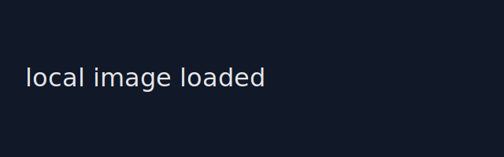

+++
title = "Demo: math, code, images"
date = 2026-01-01T00:00:00Z
draft = true
math = true
+++

This sentence contains inline code: `like this`.

This sentence contains inline math: $E=mc^2$.

Here is display math:

$$
\int_{-\infty}^{\infty} e^{-x^2}\\,dx = \sqrt{\pi}
$$

Here is a fenced code block with syntax highlighting:

```python
def greet(name: str) -> None:
    print(f"Hello, {name}!")

greet("world")
```

Here is a local image from the same leaf bundle:



Here is the same image served from static assets:


